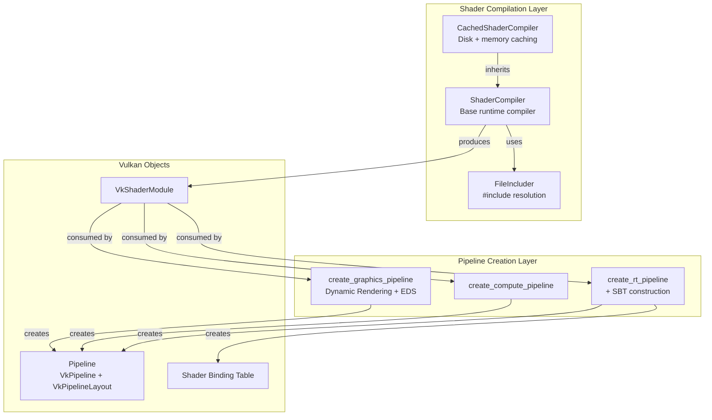

The Pipeline and Shader System in Himalaya provides a streamlined abstraction over Vulkan's complex pipeline state objects and shader compilation workflows. This system bridges the gap between high-level rendering passes and low-level GPU execution, offering runtime GLSL-to-SPIR-V compilation with intelligent caching, support for all modern Vulkan pipeline types (graphics, compute, and ray tracing), and a dynamic state model that minimizes pipeline permutation explosion while maintaining performance.

## Architecture Overview

The system is organized into three primary layers that work together to transform shader source code into executable GPU commands. At the foundation sits the **ShaderCompiler** class, which handles GLSL parsing and SPIR-V code generation using Google's shaderc library. Above this, the pipeline creation functions—`create_graphics_pipeline`, `create_compute_pipeline`, and `create_rt_pipeline`—encapsulate the Vulkan boilerplate required to configure fixed-function stages, shader bindings, and pipeline layouts. The top layer consists of the **CachedShaderCompiler** from the framework layer, which extends the base compiler with persistent disk caching to eliminate compilation overhead across application restarts.

Sources: [shader.h](https://github.com/1PercentSync/himalaya/blob/main/rhi/include/himalaya/rhi/shader.h#L25-L117), [cached_shader_compiler.cpp](https://github.com/1PercentSync/himalaya/blob/main/framework/src/cached_shader_compiler.cpp#L1-L211), [pipeline.cpp](https://github.com/1PercentSync/himalaya/blob/main/rhi/src/pipeline.cpp#L1-L199)

## Shader Compilation and Caching

The **ShaderCompiler** class provides runtime GLSL compilation without requiring external build tools or precompiled SPIR-V binaries. This design choice prioritizes rapid iteration during development—shaders can be modified and reloaded without restarting the application. The compiler uses shaderc to target Vulkan 1.4 with environment-specific optimization: debug builds disable optimizations and generate debug information for RenderDoc source mapping, while release builds use performance optimization.

A key architectural decision is the **include-aware caching system**. The compiler tracks all files transitively included during compilation, storing their content alongside the compiled SPIR-V. On cache lookup, it re-reads all included files and compares their content to detect changes in shared headers. This ensures that modifying a common header like `bindings.glsl` correctly invalidates all dependent shaders. The cache key combines a stage-specific prefix character with the full source text, providing collision-free identification across shader stages.

The **FileIncluder** implementation distinguishes between relative includes (`#include "..."`) that resolve relative to the requesting file's directory, and standard includes (`#include <...>`) that resolve from the configured root directory. This matches C++ include semantics and enables clean organization of shared shader libraries.

Sources: [shader.cpp](https://github.com/1PercentSync/himalaya/blob/main/rhi/src/shader.cpp#L11-L87), [shader.cpp](https://github.com/1PercentSync/himalaya/blob/main/rhi/src/shader.cpp#L170-L228), [shader.h](https://github.com/1PercentSync/himalaya/blob/main/rhi/include/himalaya/rhi/shader.h#L78-L88)

### Disk Caching Layer

The **CachedShaderCompiler** extends the base compiler with persistent disk caching using the framework's cache system. It computes a 128-bit content hash (XXH3) from the composite string of stage prefix, file path, null delimiter, and source content. Including the path in the hash prevents collisions between different shader files that might have identical source but different include resolution contexts.

The disk cache stores two files per compiled shader: a `.spv` binary file containing the SPIR-V bytecode, and a `.meta` JSON file tracking the content hashes of all included dependencies. On cache hit, the metadata is validated against current file content before returning the cached bytecode. This two-tier caching (memory + disk) ensures that shader compilation overhead is paid only when source files actually change.

Sources: [cached_shader_compiler.cpp](https://github.com/1PercentSync/himalaya/blob/main/framework/src/cached_shader_compiler.cpp#L30-L70), [cached_shader_compiler.cpp](https://github.com/1PercentSync/himalaya/blob/main/framework/src/cached_shader_compiler.cpp#L124-L160)

## Graphics Pipeline Creation

The graphics pipeline creation leverages **Dynamic Rendering** and **Extended Dynamic State (EDS)** to eliminate the need for VkRenderPass objects and reduce pipeline permutation count. Rather than baking viewport, scissor, cull mode, depth state, and depth bias values into the pipeline, these states are marked dynamic and configured at command buffer recording time via the CommandBuffer interface.

The **GraphicsPipelineDesc** structure captures all static configuration: shader modules, vertex input layout, color and depth attachment formats, primitive topology, sample count, and blending options. The vertex input uses explicit binding and attribute descriptions that must match the CPU-side vertex structure. For depth-only passes, the fragment shader can be omitted by setting it to `VK_NULL_HANDLE`.

The pipeline layout is created from descriptor set layouts and push constant ranges provided in the description. Himalaya uses a three-set binding model: Set 0 for per-frame global data (uniforms and SSBOs), Set 1 for bindless textures, and Set 2 for render target intermediate products. This layout is consistent across all graphics pipelines, enabling descriptor set reuse.

Sources: [pipeline.h](https://github.com/1PercentSync/himalaya/blob/main/rhi/include/himalaya/rhi/pipeline.h#L21-L63), [pipeline.cpp](https://github.com/1PercentSync/himalaya/blob/main/rhi/src/pipeline.cpp#L8-L151)

### Dynamic State Configuration

The following states are configured dynamically at draw time rather than baked into the pipeline:

| Dynamic State | CommandBuffer Method | Typical Usage |
|--------------|---------------------|---------------|
| Viewport | `set_viewport()` | Per-render-pass dimensions |
| Scissor | `set_scissor()` | Per-render-pass dimensions |
| Cull Mode | `set_cull_mode()` | Material-specific (double-sided) |
| Front Face | `set_front_face()` | Consistent CCW winding |
| Depth Test | `set_depth_test_enable()` | Pass-specific (PrePass vs Forward) |
| Depth Write | `set_depth_write_enable()` | Pass-specific |
| Depth Compare | `set_depth_compare_op()` | EQUAL for Forward, LESS for PrePass |
| Depth Bias | `set_depth_bias()` | Shadow map bias per-cascade |

Sources: [pipeline.cpp](https://github.com/1PercentSync/himalaya/blob/main/rhi/src/pipeline.cpp#L101-L116), [forward_pass.cpp](https://github.com/1PercentSync/himalaya/blob/main/passes/src/forward_pass.cpp#L174-L177)

## Compute Pipeline Creation

Compute pipelines follow a simpler creation path with only a single shader stage. The **ComputePipelineDesc** structure accepts the compute shader module, descriptor set layouts, and push constant ranges. Unlike graphics pipelines, compute pipelines have no vertex input, rasterization, or attachment configuration. The same Pipeline structure holds both the VkPipeline and VkPipelineLayout, with destruction handling both objects.

Sources: [pipeline.h](https://github.com/1PercentSync/himalaya/blob/main/rhi/include/himalaya/rhi/pipeline.h#L101-L124), [pipeline.cpp](https://github.com/1PercentSync/himalaya/blob/main/rhi/src/pipeline.cpp#L153-L198)

## Ray Tracing Pipeline and SBT Management

The ray tracing pipeline creation represents the most complex pipeline type, requiring **Shader Binding Table (SBT)** construction alongside the pipeline itself. The **RTPipelineDesc** specifies five shader modules: raygen, environment miss, shadow miss, closest-hit, and optional any-hit. The SBT layout follows a fixed four-group structure:

| Group Index | Type | Purpose |
|------------|------|---------|
| 0 | Raygen | Primary ray generation |
| 1 | Miss | Environment/sky sampling |
| 2 | Miss | Shadow ray termination |
| 3 | Hit Group | Closest-hit + optional any-hit for alpha testing |

The SBT buffer is allocated with CPU-to-GPU visibility and device address capability. Shader group handles are queried from the pipeline using `vkGetRayTracingShaderGroupHandlesKHR`, then written into the SBT with proper alignment. The resulting **VkStridedDeviceAddressRegionKHR** structures for raygen, miss, and hit regions are pre-computed and stored in the RTPipeline structure for direct use with `vkCmdTraceRaysKHR`.

Sources: [rt_pipeline.h](https://github.com/1PercentSync/himalaya/blob/main/rhi/include/himalaya/rhi/rt_pipeline.h#L24-L53), [rt_pipeline.cpp](https://github.com/1PercentSync/himalaya/blob/main/rhi/src/rt_pipeline.cpp#L1-L215)

## Shader Module Lifecycle

Shader modules are created from compiled SPIR-V bytecode using `create_shader_module()`. Following Vulkan best practices, these modules are typically short-lived objects: created immediately before pipeline creation and destroyed immediately after. The Pipeline structure does not own the shader modules—only the pipeline and layout handles. This design keeps the Pipeline structure lightweight and focused on the persistent GPU state.

Sources: [shader.cpp](https://github.com/1PercentSync/himalaya/blob/main/rhi/src/shader.cpp#L233-L246), [forward_pass.cpp](https://github.com/1PercentSync/himalaya/blob/main/passes/src/forward_pass.cpp#L77-L100)

## Integration with Rendering Passes

Render passes interact with the pipeline system through a consistent pattern demonstrated in **ForwardPass**. The `setup()` method stores references to the Context, ResourceManager, DescriptorManager, and ShaderCompiler. Pipeline creation is deferred to `create_pipelines()`, which compiles shaders, creates temporary modules, builds the pipeline, then immediately destroys the modules.

The **hot-reload capability** is implemented by re-running `create_pipelines()` when shaders change. The implementation follows a safe replacement pattern: compile new shaders first, only destroy the old pipeline if compilation succeeds, then create the new pipeline. This ensures the renderer never enters a broken state due to shader compilation errors.

Sources: [forward_pass.cpp](https://github.com/1PercentSync/himalaya/blob/main/passes/src/forward_pass.cpp#L28-L101)

## Shader Stage Support

The system supports all Vulkan shader stages through the **ShaderStage** enumeration:

| Stage | shaderc Kind | Typical Usage |
|-------|-------------|---------------|
| Vertex | `shaderc_glsl_vertex_shader` | Geometry transformation |
| Fragment | `shaderc_glsl_fragment_shader` | PBR shading, post-processing |
| Compute | `shaderc_glsl_compute_shader` | GTAO, IBL precomputation |
| RayGen | `shaderc_glsl_raygen_shader` | Path tracing camera rays |
| ClosestHit | `shaderc_glsl_closesthit_shader` | Ray intersection shading |
| AnyHit | `shaderc_glsl_anyhit_shader` | Alpha testing in ray tracing |
| Miss | `shaderc_glsl_miss_shader` | Environment sampling, shadow termination |

Sources: [types.h](https://github.com/1PercentSync/himalaya/blob/main/rhi/include/himalaya/rhi/types.h#L78-L86), [shader.cpp](https://github.com/1PercentSync/himalaya/blob/main/rhi/include/himalaya/rhi/shader.h#L90-L101)

## Best Practices and Design Decisions

**Pipeline State Minimization**: By leveraging Extended Dynamic State, the system avoids the combinatorial explosion of pipeline permutations that would result from baking viewport, cull mode, and depth state into each pipeline. This reduces memory overhead and improves CPU-side cache efficiency.

**Consistent Descriptor Set Layout**: All graphics and compute pipelines share the same three-set layout (global, bindless, render targets). This enables descriptor sets to be bound once and reused across multiple pipelines within a pass, minimizing descriptor set switching overhead.

**Compilation Failure Handling**: The shader compilation API returns empty vectors on failure rather than throwing exceptions or aborting. This allows render passes to implement graceful degradation—keeping the previous working pipeline when new shader compilation fails.

**Memory Management**: Pipeline destruction is explicit via the `destroy()` method rather than using RAII. This aligns with the broader RHI design where GPU resource lifetimes are managed deterministically, ensuring proper destruction order relative to the device and allocator.

## Related Documentation

For command buffer recording and dynamic state configuration, see [Command Buffer and Synchronization](https://github.com/1PercentSync/himalaya/blob/main/10-command-buffer-and-synchronization). The descriptor set layout and bindless texture system is detailed in [Resource Management (Buffers, Images, Samplers)](https://github.com/1PercentSync/himalaya/blob/main/8-resource-management-buffers-images-samplers). Ray tracing acceleration structures and the TLAS binding used with RTPipeline are covered in [Ray Tracing Infrastructure (AS, RT Pipeline)](https://github.com/1PercentSync/himalaya/blob/main/11-ray-tracing-infrastructure-as-rt-pipeline). For the high-level integration of pipelines into the frame rendering flow, refer to [Render Graph System](https://github.com/1PercentSync/himalaya/blob/main/12-render-graph-system).