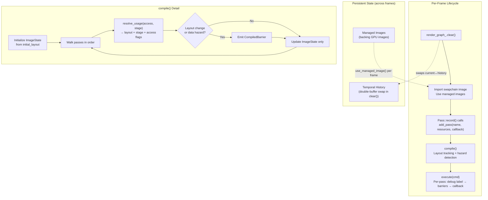

The render graph is a **frame-level scheduling layer** that sits between the pass implementations and the Vulkan command buffer. Its single responsibility is eliminating manual synchronization: passes declare *what* they access and *how*, and the graph computes the exact set of `VkImageMemoryBarrier2` transitions needed between every consecutive pass. The result is a deterministic, zero-overdraw frame pipeline where every image layout transition, execution dependency, and memory access flag is derived mechanically from declarative usage annotations — never hand-authored.

## Architecture Overview

The render graph operates on a strict **per-frame lifecycle**: `clear() → import/use resources → add passes → compile() → execute()`. Nothing persists across frame boundaries except *managed image* backing storage and their temporal history state. Each frame rebuilds the entire resource registry, pass list, and compiled barrier set from scratch — a deliberate design choice that eliminates stale-reference bugs and makes the graph's behavior fully predictable from reading a single frame's code path.



Sources: [render_graph.h](https://github.com/1PercentSync/himalaya/blob/main/framework/include/himalaya/framework/render_graph.h#L170-L266), [render_graph.cpp](https://github.com/1PercentSync/himalaya/blob/main/framework/src/render_graph.cpp#L102-L534)

## Resource Types and Identity

The graph distinguishes two categories of resources, each with a distinct lifetime and ownership model.

### Imported Resources

Resources created outside the graph (swapchain images, material buffers) are registered via `import_image()` or `import_buffer()`. Each import returns an **`RGResourceId`** — a lightweight opaque handle (wrapping a `uint32_t` index) that is only valid within the current frame. Imported images require explicit `initial_layout` and `final_layout` parameters so the graph can transition them into and out of the correct Vulkan layouts at frame boundaries.

Sources: [render_graph.h](https://github.com/1PercentSync/himalaya/blob/main/framework/include/himalaya/framework/render_graph.h#L106-L122), [render_graph.cpp](https://github.com/1PercentSync/himalaya/blob/main/framework/src/render_graph.cpp#L65-L100)

### Managed Resources

Managed images are **owned by the graph** — it creates and caches the backing GPU image, automatically rebuilding it when the reference resolution changes or when `update_managed_desc()` alters the image properties. A `RGManagedHandle` provides persistent identity across frames, while `use_managed_image()` must be called each frame to obtain the per-frame `RGResourceId` for pass declarations. This split between persistent handle and per-frame ID is the key design pattern that enables automatic resize handling without any pass-level code changes.

The `RGImageDesc` struct supports two sizing modes:

| Mode | Use Case | Resolution Source |
|------|----------|-------------------|
| `RGSizeMode::Relative` | Screen-sized targets (depth, HDR color, AO) | `reference_extent × scale` |
| `RGSizeMode::Absolute` | Resolution-independent targets (shadow maps, LUTs) | Fixed `width × height` |

When `set_reference_resolution()` is called with a new extent (typically after swapchain recreation), the graph iterates all Relative-mode managed images, compares old vs. new resolved dimensions, and rebuilds only those whose pixel size actually changed. Temporal images additionally have their history backing rebuilt and validity reset.

Sources: [render_graph.h](https://github.com/1PercentSync/himalaya/blob/main/framework/include/himalaya/framework/render_graph.h#L25-L103), [render_graph.h](https://github.com/1PercentSync/himalaya/blob/main/framework/include/himalaya/framework/render_graph.h#L288-L396), [render_graph.cpp](https://github.com/1PercentSync/himalaya/blob/main/framework/src/render_graph.cpp#L215-L276), [render_graph.cpp](https://github.com/1PercentSync/himalaya/blob/main/framework/src/render_graph.cpp#L278-L317)

### Temporal Double Buffering

Managed images created with `temporal = true` allocate **two backing images**: a current image and a history image. On each `clear()`, the graph swaps them — the previous frame's current becomes this frame's history. This mechanism enables temporal reprojection in passes like GTAO, where the temporal filter reads the previous frame's AO output while writing to the current frame's output.

The `history_valid_` flag tracks whether the history contains meaningful data. It starts as `false` (first frame after creation or resize) and becomes `true` after one complete frame has been rendered, controlled by `temporal_frame_count_`. Passes query `is_history_valid()` to set their temporal blend factor to zero when history is invalid, preventing garbage data from contaminating the output.

Sources: [render_graph.h](https://github.com/1PercentSync/himalaya/blob/main/framework/include/himalaya/framework/render_graph.h#L451-L462), [render_graph.cpp](https://github.com/1PercentSync/himalaya/blob/main/framework/src/render_graph.cpp#L102-L118), [render_graph.cpp](https://github.com/1PercentSync/himalaya/blob/main/framework/src/render_graph.cpp#L339-L364)

## Pass Declaration Model

Each pass is registered via `add_pass()`, taking a human-readable name, a span of `RGResourceUsage` declarations, and an execute callback. The **`RGResourceUsage`** struct is the core annotation mechanism — it tells the graph exactly how the pass accesses each resource:

```cpp
struct RGResourceUsage {
    RGResourceId resource;  // Which image or buffer
    RGAccessType access;    // Read, Write, or ReadWrite
    RGStage stage;          // Pipeline stage context
};
```

The three access types map directly to GPU hazard semantics:

| `RGAccessType` | GPU Semantics | Typical Usage |
|----------------|---------------|---------------|
| `Read` | Sampler load, depth comparison | Sampling textures, reading depth for AO |
| `Write` | Color output, storage image write | Color attachment, compute shader output |
| `ReadWrite` | Depth test + write, storage read-write | Depth prepass (depth attachment), atomic operations |

The `RGStage` enum determines the Vulkan image layout, pipeline stage, and access flags for barrier generation:

| `RGStage` | Image Layout | Pipeline Stage | Typical Pass |
|-----------|-------------|----------------|--------------|
| `ColorAttachment` | `COLOR_ATTACHMENT_OPTIMAL` | `COLOR_ATTACHMENT_OUTPUT` | Forward, Tonemapping, ImGui |
| `DepthAttachment` | `DEPTH_ATTACHMENT_OPTIMAL` / `DEPTH_READ_ONLY_OPTIMAL` | `EARLY/LATE_FRAGMENT_TESTS` | Depth Prepass (RW), Forward (R) |
| `Fragment` | `SHADER_READ_ONLY_OPTIMAL` | `FRAGMENT_SHADER` | Forward (AO/shadow sampling), Tonemapping |
| `Compute` | `SHADER_READ_ONLY_OPTIMAL` / `GENERAL` | `COMPUTE_SHADER` | GTAO, AO Spatial/Temporal, Contact Shadows |
| `Transfer` | `TRANSFER_SRC/DST_OPTIMAL` | `COPY_BIT` | Buffer-to-image uploads |
| `RayTracing` | `SHADER_READ_ONLY_OPTIMAL` / `GENERAL` | `RAY_TRACING_SHADER` | Path tracing accumulation |

Sources: [render_graph.h](https://github.com/1PercentSync/himalaya/blob/main/framework/include/himalaya/framework/render_graph.h#L130-L168), [render_graph.cpp](https://github.com/1PercentSync/himalaya/blob/main/framework/src/render_graph.cpp#L130-L213)

## Compilation — Barrier Insertion Algorithm

The `compile()` method is the graph's reasoning engine. It performs a single linear pass over all registered passes, tracking each image's current layout and last-access metadata, and emits a `CompiledBarrier` whenever a layout transition or data hazard is detected.

### ImageState Tracking

For each image, the compiler maintains a triple:

```cpp
struct ImageState {
    VkImageLayout current_layout;
    VkPipelineStageFlags2 last_stage;
    VkAccessFlags2 last_access;
};
```

Initial values come from `import_image()`'s `initial_layout` parameter, with `last_stage = TOP_OF_PIPE` and `last_access = NONE` (no prior access assumed). For each resource usage in each pass, the compiler calls `resolve_usage()` to obtain the target layout, stage, and access flags, then compares against the current state.

Sources: [render_graph.cpp](https://github.com/1PercentSync/himalaya/blob/main/framework/src/render_graph.cpp#L417-L491)

### Hazard Detection

A barrier is emitted when **either** a layout change or a data hazard is detected. The hazard analysis covers all three classic patterns:

| Hazard Pattern | Condition | Example |
|---------------|-----------|---------|
| **RAW** (Read-After-Write) | `prev_wrote = true` | GTAO writes AO → Forward reads AO |
| **WAW** (Write-After-Write) | `prev_wrote = true` | Depth Prepass writes depth → Shadow reads depth |
| **WAR** (Write-After-Read) | `current_writes && prev_access != NONE` | Forward reads depth → Tonemapping writes swapchain |
| RAR (Read-After-Read) | No barrier needed | — |

The `kWriteFlags` mask combines `COLOR_ATTACHMENT_WRITE`, `DEPTH_STENCIL_WRITE`, `TRANSFER_WRITE`, and `SHADER_STORAGE_WRITE` — covering all write access patterns the graph encounters. This conservative approach ensures correctness; the only optimization is skipping RAR (read-after-read), which never requires a barrier.

```cpp
const bool layout_change = state.current_layout != resolved.layout;
const bool prev_wrote = (state.last_access & kWriteFlags) != 0;
const bool current_writes = (resolved.access & kWriteFlags) != 0;
const bool has_hazard = prev_wrote
                     || (current_writes && state.last_access != VK_ACCESS_2_NONE);

if (layout_change || has_hazard) {
    compiled.barriers.push_back({ ... });
}
```

Sources: [render_graph.cpp](https://github.com/1PercentSync/himalaya/blob/main/framework/src/render_graph.cpp#L459-L490)

### Final Layout Transitions

After processing all passes, the compiler walks the resource list once more to emit **final barriers** for imported images whose `final_layout` differs from their current layout. This ensures swapchain images end up in `PRESENT_SRC_KHR` and persistent depth/ AO textures are in `SHADER_READ_ONLY_OPTIMAL` for the next frame's temporal access. Managed images with `final_layout = UNDEFINED` are skipped — their content is either fully overwritten each frame or handled by the temporal swap mechanism.

Sources: [render_graph.cpp](https://github.com/1PercentSync/himalaya/blob/main/framework/src/render_graph.cpp#L493-L518)

## Execution — Command Buffer Recording

The `execute()` method is a tight loop over all compiled passes:

```
For each pass i:
  1. cmd.begin_debug_label(pass_name, pass_debug_color(i))
  2. emit_barriers(cmd, compiled_passes[i].barriers)
  3. pass.execute(cmd)
  4. cmd.end_debug_label()

emit_barriers(cmd, final_barriers)
```

Each pass is wrapped in a debug label colored via **golden-angle hue distribution** — a technique that maximizes visual distinctness between sequential passes in RenderDoc and Nsight Graphics. The `emit_barriers()` helper batch-converts `CompiledBarrier` structs into `VkImageMemoryBarrier2` arrays and submits them via a single `vkCmdPipelineBarrier2` call (the Synchronization2 extension), minimizing per-barrier overhead.

Sources: [render_graph.cpp](https://github.com/1PercentSync/himalaya/blob/main/framework/src/render_graph.cpp#L520-L578), [render_graph.cpp](https://github.com/1PercentSync/himalaya/blob/main/framework/src/render_graph.cpp#L17-L58)

## Barrier Emission Detail

Each compiled barrier maps directly to a `VkImageMemoryBarrier2` structure:

| Barrier Field | Source |
|--------------|--------|
| `srcStageMask` | Previous pass's `last_stage` |
| `srcAccessMask` | Previous pass's `last_access` |
| `dstStageMask` | Current pass's resolved `stage` |
| `dstAccessMask` | Current pass's resolved `access` |
| `oldLayout` / `newLayout` | Tracked layout → resolved layout |
| `image` | Resolved from `ImageHandle` via `ResourceManager` |
| `subresourceRange` | Auto-derived from format (color vs. depth aspect) |

All mip levels (`VK_REMAINING_MIP_LEVELS`) and array layers (`VK_REMAINING_ARRAY_LAYERS`) are included, matching the render graph's assumption that managed images are single-layer, single-mip resources. The `VkDependencyInfo` is submitted with only image barriers (no buffer or memory barriers), since the graph's barrier model currently handles image layout transitions exclusively.

Sources: [render_graph.cpp](https://github.com/1PercentSync/himalaya/blob/main/framework/src/render_graph.cpp#L536-L578)

## Usage Pattern — Rasterization Frame

The following shows the complete rasterization frame as built in `render_rasterization()`. This is the primary usage pattern and demonstrates all graph features in concert:

```mermaid
flowchart LR
    subgraph "Resource Setup"
        CL["clear()"] --> SW["import swapchain<br/>(UNDEFINED → PRESENT_SRC)"]
        SW --> HDR["use_managed hdr_color<br/>(UNDEFINED, preserve=false)"]
        HDR --> DEP["use_managed depth<br/>(SHADER_READ_ONLY, preserve=false)<br/>+ get_history_image depth_prev"]
        DEP --> AO["use_managed ao_noisy/blurred<br/>use_managed ao_filtered (temporal)<br/>+ get_history_image ao_history"]
        AO --> CS["use_managed contact_shadow_mask"]
        CS --> DESC["Update Set 2 descriptors<br/>(depth, ao_filtered)"]
    end

    subgraph "Pass Recording"
        DESC --> SH["Shadow Pass<br/>(if shadows active)"]
        SH --> DP["Depth Prepass<br/>(depth:RW, normal:W, roughness:W)"]
        DP --> GT["GTAO Pass<br/>(depth:R, normal:R → ao_noisy:W)"]
        GT --> AS["AO Spatial<br/>(ao_noisy:R → ao_blurred:W)"]
        AS --> AT["AO Temporal<br/>(ao_blurred:R, history:R → ao_filtered:W)"]
        AT --> CS2["Contact Shadows<br/>(depth:R → mask:W)"]
        CS2 --> FW["Forward Pass<br/>(hdr_color:W, depth:R, ao_filtered:R, mask:R)"]
        FW --> SK["Skybox Pass"]
        SK --> TM["Tonemapping<br/>(hdr_color:R → swapchain:W)"]
        TM --> IM["ImGui<br/>(swapchain:RW)"]
    end

    subgraph "Compile & Execute"
        IM --> COM["compile()"]
        COM --> EXE["execute(cmd)"]
    end
```



### Pass Resource Declarations in Practice

The **Depth Prepass** demonstrates the most complex resource declaration — it writes depth (read-write for depth testing) and writes two color attachments (normal and roughness):

```cpp
// Non-MSAA path:
const std::array resources = {
    RGResourceUsage{ ctx.depth,    RGAccessType::ReadWrite, RGStage::DepthAttachment },
    RGResourceUsage{ ctx.normal,   RGAccessType::Write,     RGStage::ColorAttachment },
    RGResourceUsage{ ctx.roughness, RGAccessType::Write,    RGStage::ColorAttachment },
};
rg.add_pass("DepthPrePass", resources, execute);
```

The **Forward Pass** shows a mixed read/write pattern with cross-stage dependencies — it reads the depth buffer from the prepass (DepthAttachment stage), writes HDR color (ColorAttachment), and reads compute-written AO and contact shadow masks (Fragment stage). Declaring these Fragment-stage reads ensures the graph emits compute→fragment barriers:

```cpp
resources.push_back({ctx.ao_filtered, RGAccessType::Read, RGStage::Fragment});
resources.push_back({ctx.contact_shadow_mask, RGAccessType::Read, RGStage::Fragment});
```

The **GTAO Pass** is a pure compute pass that reads depth+normal and writes to a storage image — a compute→compute barrier chain when followed by AO Spatial:

```cpp
const std::array resources = {
    RGResourceUsage{ ctx.depth,   RGAccessType::Read,  RGStage::Compute },
    RGResourceUsage{ ctx.normal,  RGAccessType::Read,  RGStage::Compute },
    RGResourceUsage{ ctx.ao_noisy, RGAccessType::Write, RGStage::Compute },
};
```

Sources: [renderer_rasterization.cpp](https://github.com/1PercentSync/himalaya/blob/main/app/src/renderer_rasterization.cpp#L219-L366), [depth_prepass.cpp](https://github.com/1PercentSync/himalaya/blob/main/passes/src/depth_prepass.cpp#L272-L329), [forward_pass.cpp](https://github.com/1PercentSync/himalaya/blob/main/passes/src/forward_pass.cpp#L207-L238), [gtao_pass.cpp](https://github.com/1PercentSync/himalaya/blob/main/passes/src/gtao_pass.cpp#L118-L174)

## Managed Image Lifecycle

The relationship between persistent handles and per-frame IDs is central to understanding the graph's resource model:

| Operation | Timing | Returns | Purpose |
|-----------|--------|---------|---------|
| `create_managed_image()` | Init | `RGManagedHandle` (persistent) | Allocate backing GPU image |
| `set_reference_resolution()` | Resize | — | Rebuild Relative images if dimensions changed |
| `update_managed_desc()` | MSAA change | — | Rebuild if properties changed |
| `use_managed_image()` | Every frame | `RGResourceId` (per-frame) | Import current backing into graph |
| `get_history_image()` | Every frame | `RGResourceId` (per-frame) | Import history backing (temporal only) |
| `destroy_managed_image()` | Shutdown | — | Release GPU image |

The `use_managed_image()` `preserve_content` parameter controls the initial layout: `true` sets `GENERAL` (previous frame content retained), `false` sets `UNDEFINED` (content discarded — optimal for images fully overwritten by rendering).

Sources: [renderer_init.cpp](https://github.com/1PercentSync/himalaya/blob/main/app/src/renderer_init.cpp#L39-L155), [render_graph.cpp](https://github.com/1PercentSync/himalaya/blob/main/framework/src/render_graph.cpp#L278-L337)

## Design Principles and Tradeoffs

**Linear execution order.** The graph does not perform topological sorting or reordering — passes execute in registration order. This is a deliberate simplicity tradeoff: the renderer already knows the correct pass order, and automatic reordering would add complexity without benefit for a fixed pipeline. The barrier algorithm's correctness is independent of whether passes are optimally ordered.

**Image-only barrier model.** Buffer resources are imported and tracked but do not generate barriers. This reflects the project's bindless architecture where buffer accesses are synchronized implicitly through per-frame double-buffering (each frame index has its own UBO/SSBO set, ensuring no cross-frame hazards).

**Conservative hazard analysis.** The barrier algorithm errs on the side of emitting too many barriers rather than too few. WAR (write-after-read) hazards trigger barriers even when the previous read is from a different image subresource. For the graph's use cases — single-layer, single-mip images — this is always correct and rarely suboptimal.

**No subresource tracking.** All barriers apply to the entire image (`VK_REMAINING_MIP_LEVELS`, `VK_REMAINING_ARRAY_LAYERS`). This simplification is valid because managed images in himalaya are always single-mip, single-layer resources. Shadow maps are the only multi-layer images, and they use the full array range in their barriers.

Sources: [render_graph.h](https://github.com/1PercentSync/himalaya/blob/main/framework/include/himalaya/framework/render_graph.h#L170-L180), [render_graph.cpp](https://github.com/1PercentSync/himalaya/blob/main/framework/src/render_graph.cpp#L417-L518)

## Next Steps

- [Resource Management — Generation-Based Handles, Buffers, Images, and Samplers](https://github.com/1PercentSync/himalaya/blob/main/6-resource-management-generation-based-handles-buffers-images-and-samplers) — Understanding how `ImageHandle` and `BufferHandle` resolve to Vulkan objects during barrier emission
- [Material System — GPU Data Layout and Bindless Texture Indexing](https://github.com/1PercentSync/himalaya/blob/main/10-material-system-gpu-data-layout-and-bindless-texture-indexing) — How the bindless descriptor architecture interacts with render graph resource declarations
- [Depth Prepass — Z-Fill for Zero-Overdraw Forward Rendering](https://github.com/1PercentSync/himalaya/blob/main/16-depth-prepass-z-fill-for-zero-overdraw-forward-rendering) — A complete example of a pass declaring complex MSAA resource usage
- [GTAO Pass — Horizon-Based Ambient Occlusion with Spatial and Temporal Denoising](https://github.com/1PercentSync/himalaya/blob/main/19-gtao-pass-horizon-based-ambient-occlusion-with-spatial-and-temporal-denoising) — The compute→compute→compute barrier chain in action
- [Renderer Core — Frame Dispatch, GPU Data Fill, and Rasterization vs Path Tracing](https://github.com/1PercentSync/himalaya/blob/main/22-renderer-core-frame-dispatch-gpu-data-fill-and-rasterization-vs-path-tracing) — The full frame dispatch that orchestrates the render graph lifecycle