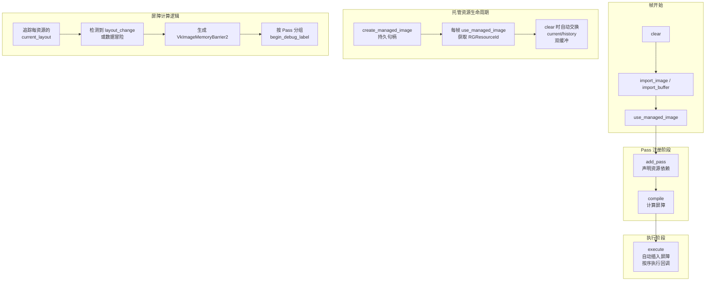
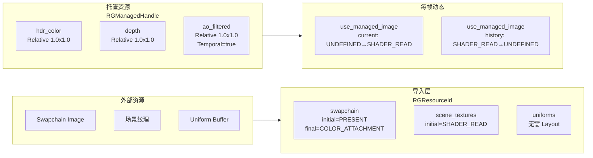

渲染框架层是 Himalaya 引擎的**资源协调中枢**，负责连接高层应用逻辑与底层 RHI Vulkan 抽象。该层通过 Render Graph 自动管理 GPU 资源的生命周期、布局转换和 Pass 编排，同时提供场景数据结构、材质系统、纹理加载、IBL 预计算等核心服务。框架层的设计遵循**显式数据流**原则：所有渲染所需的输入数据通过 `SceneRenderData` 和 `FrameContext` 显式传递，避免隐式全局状态，确保多线程安全和可测试性。

## Render Graph 核心架构

Render Graph 是框架层的**调度核心**，每帧重建以支持动态管线配置。它将 GPU 资源抽象为两种类型：**导入资源**（外部创建的 Swapchain、场景纹理）和**托管资源**（图内部管理的临时/历史缓冲区）。通过声明式 API，Pass 只需描述资源访问模式（读/写/读写）和管线阶段（片段/计算/光追），图自动计算并插入必要的 Image Layout 转换和内存屏障。



### 资源导入与托管机制

导入资源通过 `import_image()` 和 `import_buffer()` 将外部创建的 RHI 资源纳入图的管理，需提供初始 Layout 和最终 Layout。托管资源则完全由图管理生命周期：`create_managed_image()` 返回持久句柄，每帧调用 `use_managed_image()` 将其导入当前帧图。托管图像支持两种尺寸模式：**Relative**（相对于参考分辨率的比例，用于屏幕空间缓冲区）和 **Absolute**（固定像素尺寸，用于阴影贴图等）。托管资源还支持**时域双缓冲**（temporal=true），图在 `clear()` 时自动交换 current 和 history 缓冲区，支持 TAA、GTAO 等时域算法的历史采样需求。



**关键设计决策**：托管资源的当前缓冲区每帧以 `UNDEFINED` 初始 Layout 导入（内容可丢弃），而历史缓冲区以 `SHADER_READ_ONLY_OPTIMAL` 导入并带 `final_layout=UNDEFINED`。这确保历史数据在下一帧作为只读纹理可用，同时避免不必要的 end-of-frame 转换。

Sources: [render_graph.h](https://github.com/1PercentSync/himalaya/blob/main/framework/include/himalaya/framework/render_graph.h#L23-L103), [render_graph.cpp](https://github.com/1PercentSync/himalaya/blob/main/framework/src/render_graph.cpp#L60-L118)

## 场景数据契约

`SceneRenderData` 定义了**应用层与渲染器之间的显式契约**，消除了传统游戏引擎中常见的隐式全局场景状态。它使用 `std::span` 引用外部数据而非拥有它，允许应用层灵活管理场景存储（连续数组、ECS 组件等）。核心结构包括：

| 结构 | 用途 | 关键字段 |
|------|------|----------|
| `MeshInstance` | 可渲染对象 | `mesh_id`, `material_id`, `transform`, `world_bounds` |
| `DirectionalLight` | 方向光源 | `direction`, `color`, `intensity`, `cast_shadows` |
| `Camera` | 相机状态 | `position`, `yaw`, `pitch`, `fov`, 派生矩阵 |
| `CullResult` | 剔除结果 | `visible_opaque_indices`, `visible_transparent_indices` |

`MeshInstance` 同时携带当前帧和上一帧的变换矩阵（`transform` / `prev_transform`），为 M2+ 的时域抗锯齿和运动向量生成预留数据。`world_bounds` 是预先计算的世界空间 AABB，用于视锥剔除和阴影 cascade 适配。

Sources: [scene_data.h](https://github.com/1PercentSync/himalaya/blob/main/framework/include/himalaya/framework/scene_data.h#L42-L117)

## FrameContext：Pass 间数据传递

`FrameContext` 是**每帧渲染的中央数据载体**，由 `Renderer` 每帧构建并传递给所有 Pass 的 `record()` 方法。它聚合了三类数据：Render Graph 资源 ID（当前帧有效的 `RGResourceId`）、场景数据引用（`span<const Mesh>`、`CullResult*`）、以及渲染配置指针（`RenderFeatures*`, `ShadowConfig*` 等）。这种设计使得新增 Pass 或渲染特性时只需扩展 `FrameContext` 字段，无需修改现有 Pass 的接口签名。

**核心资源 ID 映射**：

| 资源 ID | 格式 | 用途 |
|---------|------|------|
| `hdr_color` | R16G16B16A16_SFLOAT | 主 HDR 颜色缓冲区 |
| `depth` / `depth_prev` | D32_SFLOAT | 深度缓冲区（当前/历史） |
| `normal` / `msaa_normal` | A2B10G10R10_UNORM_PACK32 | 世界空间法线 |
| `shadow_map` | D32_SFLOAT Array | 级联阴影贴图数组 |
| `ao_noisy` / `ao_blurred` / `ao_filtered` / `ao_history` | RG8_UNORM | GTAO 处理链（噪声→双边滤波→时域→历史） |
| `contact_shadow_mask` | R8_UNORM | 接触阴影遮罩 |
| `pt_accumulation` / `pt_aux_albedo` / `pt_aux_normal` | RGBA32F / R8G8B8A8Unorm / R16G16B16A16_SFLOAT | 路径追踪累加与 OIDN 辅助缓冲区 |

`FrameContext` 还携带了 GPU 实例化绘制所需的分组数据：`opaque_draw_groups` 和 `mask_draw_groups` 是按 `mesh_id` 排序的实例组，以及按 cascade 细分的阴影绘制组。这种预分组消除了绘制时的运行时排序开销。

Sources: [frame_context.h](https://github.com/1PercentSync/himalaya/blob/main/framework/include/himalaya/framework/frame_context.h#L22-L150)

## 材质系统与 GPU 数据布局

材质系统负责将 glTF 材质定义转换为 GPU 友好的 SSBO 布局。`GPUMaterialData` 采用 std430 布局（80 字节），包含基础色/自发光因子、金属度/粗糙度、法线缩放等参数，以及指向全局 Bindless 纹理数组的索引。`MaterialInstance` 则维护 CPU 侧的材质元数据（`alpha_mode`, `double_sided`, `buffer_offset`），用于绘制路由决策（Opaque/Mask/Blend 分离）。

**默认纹理机制**：为了避免在着色器中分支处理缺失纹理，系统在加载时为每个材质槽位填充默认纹理索引：
- `base_color_tex`, `metallic_roughness_tex`, `occlusion_tex` → `white` (1,1,1,1)
- `normal_tex` → `flat_normal` (0.5,0.5,1,1) 
- `emissive_tex` → `black` (0,0,0,1)

Sources: [material_system.h](https://github.com/1PercentSync/himalaya/blob/main/framework/include/himalaya/framework/material_system.h#L32-L99)

## 统一顶点格式与 Mesh 管理

框架层强制所有 Mesh 使用统一的 `Vertex` 结构体（position, normal, uv0, tangent, uv1），无论源数据格式如何。这种固定布局简化了 GPU 顶点缓冲区绑定配置，也确保了着色器可以假设一致的输入格式。`Mesh` 结构体持有 RHI 缓冲区句柄和绘制所需元数据（`vertex_count`, `index_count`, `group_id`, `material_id`），其中 `group_id` 用于光线追踪的 BLAS 几何体分组。

MikkTSpace 切线生成在加载时通过 `generate_tangents()` 完成，确保法线贴图渲染的数学正确性，即使源模型缺少切线数据。

Sources: [mesh.h](https://github.com/1PercentSync/himalaya/blob/main/framework/include/himalaya/framework/mesh.h#L17-L91)

## 纹理加载与 BC 压缩管线

纹理系统实现了**离线程友好**的加载管线，将 CPU 密集型工作（解码、Mip 生成、BC 压缩）与 GPU 上传分离：

1. **加载阶段**（`load_image`）：stb_image 解码为 RGBA8 CPU 像素
2. **准备阶段**（`prepare_texture`）：生成 Mip 链 + BC7/BC5 压缩，写入磁盘缓存
3. **完成阶段**（`finalize_texture`）：在 Immediate 命令范围内上传 GPU + Bindless 注册

`TextureRole` 枚举根据纹理用途选择压缩格式：
- `Color` → BC7_SRGB（基础色、自发光，Gamma 正确）
- `Linear` → BC7_UNORM（粗糙度、金属度、AO，线性数据）
- `Normal` → BC5_UNORM（切线空间法线，仅 RG 通道，Z 在着色器重建）

`load_cached_texture()` 支持基于源文件哈希的缓存查询，允许批量管线在不解码图像的情况下判断缓存命中，避免不必要的 CPU 工作。

Sources: [texture.h](https://github.com/1PercentSync/himalaya/blob/main/framework/include/himalaya/framework/texture.h#L22-L132)

## IBL 预计算管线

`IBL` 类封装了从 HDR 环境贴图到着色器可用 IBL 数据的完整预计算流程，全部在 GPU 计算着色器中完成：

| 阶段 | 着色器 | 输出 | 用途 |
|------|--------|------|------|
| 等距圆柱 → Cubemap | `equirect_to_cubemap.comp` | 中间 Cubemap (R16G16B16A16F) | 天空盒采样源 |
| 辐照度卷积 | `irradiance.comp` | 32×32 漫反射 Cubemap (R11G11B10F) | 漫反射 IBL |
| 预过滤环境 | `prefilter.comp` | 512×512 Mip 链 Cubemap | 镜面反射 IBL（粗糙度→Mip） |
| BRDF 积分 LUT | `brdf_lut.comp` | 256×256 LUT (R16G16_UNORM) | 分裂和近似 BRDF |

所有预计算产品注册到 Set 1 Bindless 数组，通过 `GlobalUniformData` 中的索引（`irradiance_cubemap_index`, `prefiltered_cubemap_index` 等）供前向着色器访问。加载失败时自动创建 1×1 中性灰 Cubemap 作为 fallback，确保管线无需分支处理缺失 IBL 的情况。

Sources: [ibl.h](https://github.com/1PercentSync/himalaya/blob/main/framework/include/himalaya/framework/ibl.h#L22-L95)

## 视锥剔除与阴影 Cascade 计算

`culling.h` 提供了纯几何的视锥剔除实现，使用 Gribb-Hartmann 方法从 VP 矩阵提取 6 个归一化平面，通过 p-vertex 方法测试 AABB。剔除结果是实例索引数组，由 `Renderer` 进一步按材质特性分桶。

`shadow.h` 实现了 CSM（级联阴影映射）的数学计算，包括 PSSM（Practical Split Scheme）分割公式和**纹素对齐**（texel snapping）以防止相机平移时的阴影边缘闪烁。计算结果 `ShadowCascadeResult` 包含每 cascade 的光空间 VP 矩阵、分割距离、纹素世界尺寸等，直接填入 `GlobalUniformData` 的 shadow 字段供着色器消费。

Sources: [culling.h](https://github.com/1PercentSync/himalaya/blob/main/framework/include/himalaya/framework/culling.h#L17-L59), [shadow.h](https://github.com/1PercentSync/himalaya/blob/main/framework/include/himalaya/framework/shadow.h#L1-L73)

## 渲染目标格式约定

`render_constants.h` 集中定义了所有渲染目标格式，作为 Pass 实现的单一事实来源：

```cpp
constexpr VkFormat kDepthFormat = VK_FORMAT_D32_SFLOAT;           // Reverse-Z 深度
constexpr VkFormat kHdrColorFormat = VK_FORMAT_R16G16B16A16_SFLOAT; // HDR 颜色
constexpr VkFormat kNormalFormat = VK_FORMAT_A2B10G10R10_UNORM_PACK32; // 世界法线
constexpr VkFormat kRoughnessFormat = VK_FORMAT_R8_UNORM;           // 粗糙度
```

这些格式选择反映了项目的设计决策：D32 支持 Reverse-Z 深度缓冲；R16G16B16A16F 提供足够的 HDR 动态范围；A2B10G10R10 在精度和带宽间取得平衡；R8 粗糙度足以存储 0-1 范围的 perceptual roughness。

Sources: [render_constants.h](https://github.com/1PercentSync/himalaya/blob/main/framework/include/himalaya/framework/render_constants.h#L1-L28)

## 与上下层的交互关系

渲染框架层位于四层架构的**第二层**，向上为应用层提供声明式渲染接口，向下通过 RHI 层操作 Vulkan 资源：

```
┌─────────────────────────────────────────────────────────────┐
│  应用层 (Application Layer)                                   │
│  - SceneLoader 填充 Mesh/Material/Texture                   │
│  - 构建 SceneRenderData 提交给 Renderer                      │
├─────────────────────────────────────────────────────────────┤
│  渲染框架层 ← 【当前位置】                                     │
│  - RenderGraph 编排 Pass 执行                                │
│  - FrameContext 传递每帧数据                                 │
│  - IBL/Shadow/Culling 提供渲染辅助服务                       │
├─────────────────────────────────────────────────────────────┤
│  渲染 Pass 层 (Pass Layer)                                    │
│  - DepthPrepass / ForwardPass / GTAOPass 等                  │
│  - 声明资源依赖 → RenderGraph 处理屏障                        │
├─────────────────────────────────────────────────────────────┤
│  RHI 层 (Vulkan 抽象)                                         │
│  - ResourceManager / CommandBuffer / DescriptorManager       │
└─────────────────────────────────────────────────────────────┘
```

框架层的关键设计约束：**不直接发起绘制调用**。所有图形和计算工作由 Pass 层在 Render Graph 回调中通过 `CommandBuffer` API 执行，框架层仅负责资源声明和屏障编排。这种分离确保了渲染管线的模块化，新增渲染特性只需添加 Pass 而不影响框架核心。

## 相关阅读

- [Render Graph 资源管理](https://github.com/1PercentSync/himalaya/blob/main/12-render-graphzi-yuan-guan-li) — 深入理解托管资源生命周期与屏障计算算法
- [RHI层 - Vulkan抽象层](https://github.com/1PercentSync/himalaya/blob/main/8-rhiceng-vulkanchou-xiang-ceng) — 底层资源创建与命令提交机制
- [材质系统架构](https://github.com/1PercentSync/himalaya/blob/main/13-cai-zhi-xi-tong-jia-gou) — GPUMaterialData 布局与 Bindless 纹理索引
- [渲染Pass层 - 效果实现](https://github.com/1PercentSync/himalaya/blob/main/10-xuan-ran-passceng-xiao-guo-shi-xian) — 各 Pass 如何使用 FrameContext 与 RenderGraph